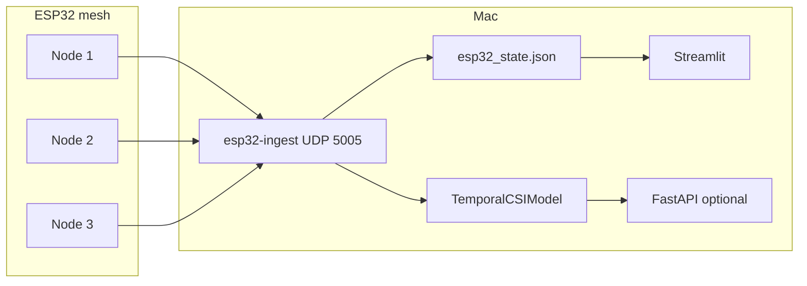

# Architecture

PresenceMap is **Mac-centric**: ESP32 nodes send CSI; the Mac ingests, stores sessions, trains, and serves a Streamlit UI.



## Components

| Layer | Module | Role |
|-------|--------|------|
| Wire | `mac_app/capture/esp32_parser.py` | RuView ADR-018 binary frames (`0xC5110001`) |
| Ingest | `mac_app/capture/esp32_ingest.py` | UDP listener, per-node health, 2 s windows, fusion |
| Features | `mac_app/capture/csi_features.py` | 174-dim CSI vector + 2 temporal deltas → 176 for ML |
| Record | `mac_app/capture/esp32_recorder.py` | `sessions/<id>/rf_windows.parquet` + labels |
| Train | `mac_app/train/` | GRU classifier (~60k params), MPS |
| Live | `mac_app/inference/esp32_runtime.py` | Reads fused window from state file → SQLite buffer |
| UI | `mac_app/dashboard/` | Diagnostics, train, models, future room/automation stubs |

## On-disk layout

```
data/survey_projects/<project>/
  project_config.json
  rooms.json              # optional, for future per-room UI
  sessions/<session_id>/
    session.json
    rf_windows.parquet
    labels.parquet
data/models/<model_id>/
  weights.pt, meta.json, eval.json
data/runtime/
  esp32_state.json        # live diagnostics (ingest process)
  live_buffer.sqlite3     # predictions (inference + API)
```

## CLI

| Command | Purpose |
|---------|---------|
| `presence-mac esp32-ingest` | Run UDP ingest + write `esp32_state.json` |
| `presence-mac esp32-record` | Record a labeled session to parquet |
| `presence-mac dashboard` | Streamlit UI |
| `presence-mac train` | Train on one or more sessions |
| `presence-mac api` | REST `/state`, `/history`, `/models` |

## RuView relationship

[RuView/](RuView/) supplies firmware, ADR-018 format, and troubleshooting notes. PresenceMap does not embed the RuView Rust sensing server; it implements a focused Python ingest path tuned for reliable multi-node diagnostics on macOS.
